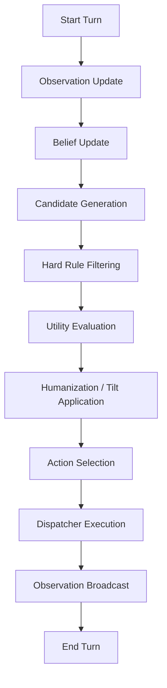

# WealthCraft AI Decision Flow

The following diagram illustrates the lifecycle of a bot's decision pipeline during a single turn in the `dispatcher.ts` game loop.

```mermaid
graph TD
    A[Start Turn] --> B[Observation Update]
    B --> C[Belief Update]
    C --> D[Candidate Generation]
    D --> E[Hard Rule Filtering]
    E --> F[Utility Evaluation]
    F --> G[Humanization / Tilt Application]
    G --> H[Action Selection]
    H --> I[Dispatcher Execution]
    I --> J[Observation Broadcast]
    J --> K[End Turn]
```
